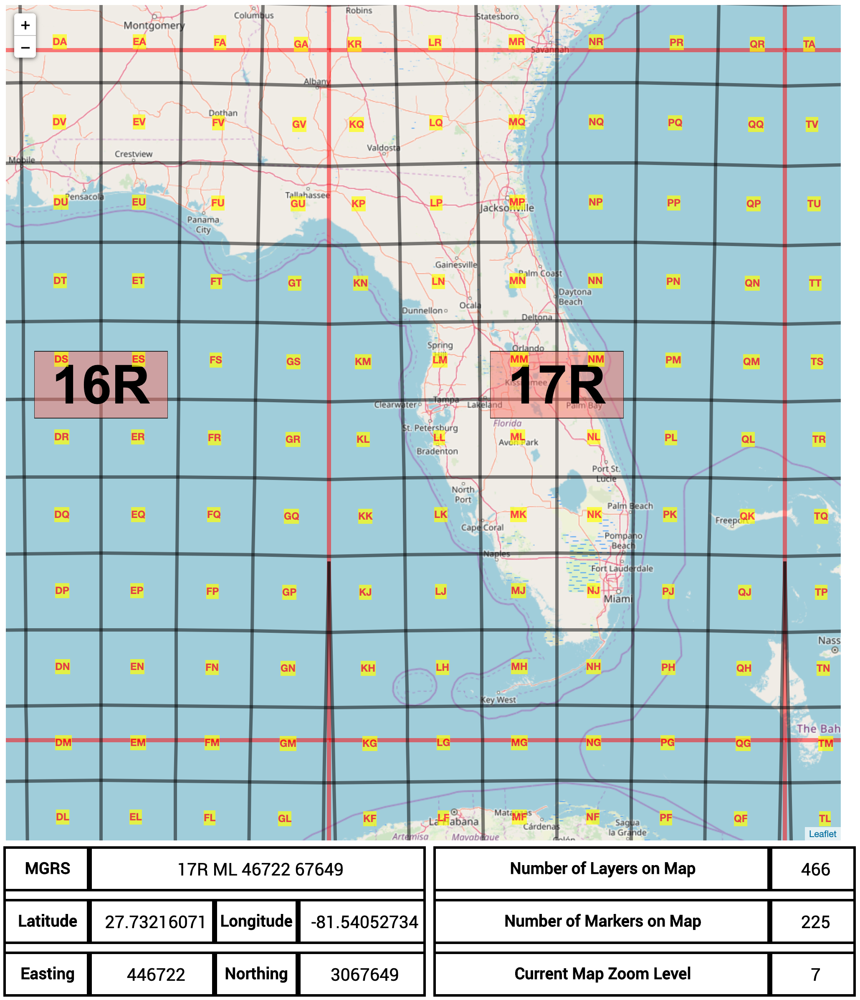
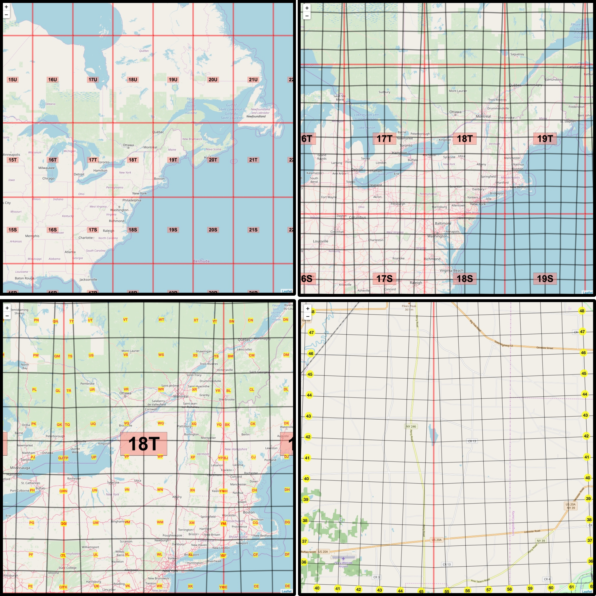

# Leaflet.DumbMGRS

An MGRS grid overlay plugin for your leaflet application. This plugin will enable you to display the Grid Zone Designators (1 million meters by 1 million meters), the 100K grid zones, and a 1000 meter grid interval 😎 This is my first Leaflet plugin, so I am open to all pull requests.

[Demo](https://mgrs-mapper.com/app)





To install, clone the repo

```sh
git clone https://github.com/pistell/Leaflet.DumbMGRS.git
```

Install dependencies:

```sh
npm install
```

To run in hot module reloading mode (uses Parcel):

```sh
npm start
```

To create a production build:

```sh
npm run build-prod
```

Parcel will watch for any changes in the /src/ folder and automatically reload

## Running

```sh
node dist/bundle.js
```

## Overview

I am trying to generate 3 types of grids

1. A Grid Zone Designator - 1 million by 1 million meter grid. The GZD is outlined in red and has a grid label in the center of it.

2. A 100K grid - 100k by 100k meter grid. This is filled with bugs and inefficient code.

3. A 1000M grid - 1000m by 1000m grid.

## Usage

---

```JavaScript
    import 'L.DumbMGRS.scss';
    import {
      L, map, generateGZDGrids, generate100kGrids, generate1000meterGrids
    } from './L.DumbMGRS';

    const map = L.map('map',{
      center: [27.3815, -82.8259],
      zoom: 7,
    });

    L.tileLayer('https://c.tile.openstreetmap.org/{z}/{x}/{y}.png', {
      maxZoom: 18,
      id: 'osm_map',
    }).addTo(map);

    // Grid Zone Designator (1 million by 1 million meters)
    const generateGZDGrids = new GZD({
      // Example of initial options for GZD grids
      showLabels: true,
      showGrids: true,
      maxZoom: 18,
      minZoom: 4,
      redraw: 'moveend',
      lineStyle: {
        color: 'red',
        weight: 5,
        opacity: 0.5,
        smoothFactor: 1,
        lineCap: 'butt',
        lineJoin: 'miter-clip',
        noClip: true,
        interactive: false,
      },
    });

    // 100K Meter Grids
    const generate100kGrids = new MGRS100K({
      // Example of initial options for 100K grids
      showLabels: true,
      showGrids: true,
      maxZoom: 18,
      minZoom: 6,
      redraw: 'moveend',
      gridLetterStyle: 'color: #216fff; font-size:12px;',
      lineStyle: {
        color: 'black',
        weight: 2,
        opacity: 0.75,
        interactive: false,
        fill: false,
        noClip: true,
        smoothFactor: 4,
        lineCap: 'butt',
        lineJoin: 'miter-clip',
      },
    });

    // 1000 Meter Grids
    const generate1000meterGrids = new MGRS1000Meters({
      // Example of initial options for 1000 meter grids
      showLabels: true,
      showGrids: true,
      redraw: 'move',
      maxZoom: 18,
      minZoom: 12,
      gridLetterStyle: 'color: black; font-size:12px;',
      lineStyle: {
        color: 'black',
        weight: 1,
        opacity: 0.5,
        interactive: false,
        fill: false,
        noClip: true,
        smoothFactor: 4,
        lineCap: 'butt',
        lineJoin: 'miter-clip',
      },
    });

    // Now add them to your map
    generateGZDGrids.addTo(map);
    generate100kGrids.addTo(map);
    generate1000meterGrids.addTo(map);

```

## Issues

- [x] Need to come up with a method that toggles grid labels on and off

- [ ] 100K grids fail around Antarctica

- [x] 100K grid labels collide with each other when they start converging near the grid zone designator boundaries

- [ ] 100K grids fail on GZD 31U,31V and 32V (These are the "special" case grid zones)

- [ ] 100K grids in GZD 31U does not work when the GZDs to the north of it are in visible range

- [ ] 1000m grids are all kinda jacked up in the southern hemisphere.
