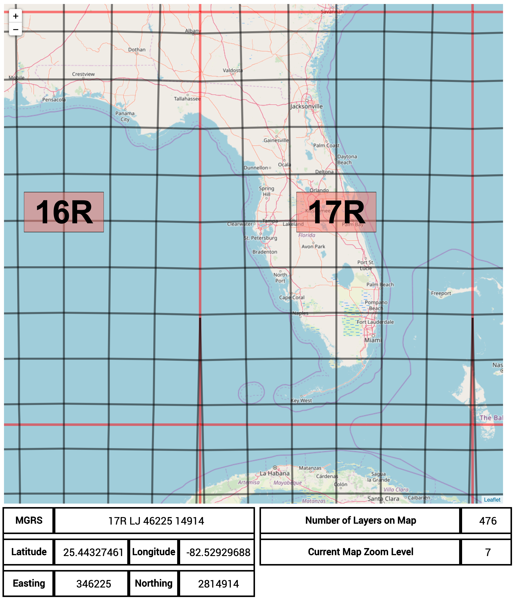

# Leaflet.DumbMGRS

An MGRS grid overlay plugin for your leaflet application... But dumber!



## Do not use this in production, this is incomplete

To install, clone the repo

```sh
git clone https://github.com/pistell/Leaflet.DumbMGRS.git
```

Install dependencies:

```sh
npm install
```

To run in hot module reloading mode (uses Parcel):

```sh
npm start
```

To create a production build:

```sh
npm run build-prod
```

Parcel will watch for any changes in the /src/ folder and automatically reload

## Running

```sh
node dist/bundle.js
```

## Issues

I am trying to generate 3 types of grids

1. A Grid Zone Designator - 1 million by 1 million meter grid. The GZD is outlined in red and has a grid label in the center of it. This actually works as I intended it to.
2. A 100K grid - 100k by 100k meter grid. The 100k grids do not "fire off" when the user scrolls to any latitudes above 72 degrees. Some grids also do not show when the user is scrolling over the idiotic "special grid zone designators" around Norway. For instance scroll to GZD 31U and see for yourself

3. A 1000M grid - 1000m by 1000m grid. I have a working version of this in the grid1000meters.js file. These grids should not be shown unless the user is at a specific zoom level.

## Other Stuff

Readme created with [createapp.dev](https://createapp.dev/)

[Leaflet publishing guide](https://github.com/Leaflet/Leaflet/blob/master/PLUGIN-GUIDE.md)
